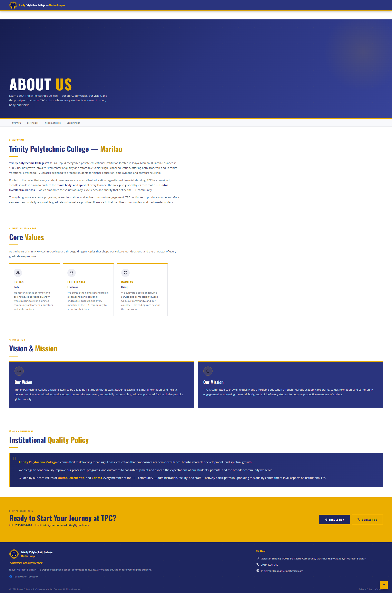
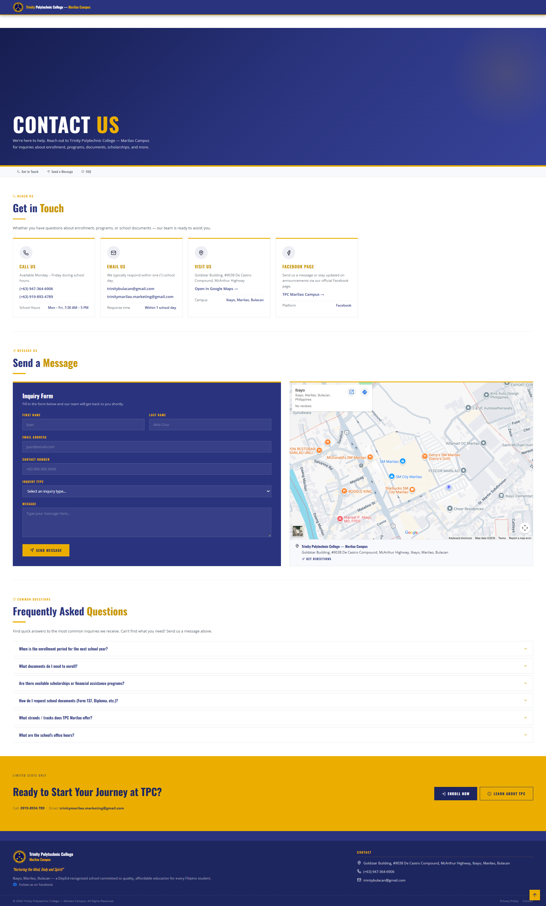

# Trinity Polytechnic College — Marilao Campus
### School Website

**Live:** [https://zmetrical.github.io/School-Page/](https://zmetrical.github.io/School-Page/)

---

A static front-end website for Trinity Polytechnic College — Marilao Campus. Built to give prospective students a clean look at what TPC offers — strands, freebies, contact info, and school background. No frameworks, no build step, just HTML/CSS/JS.

---

## Screenshots

| Home | About |
|---|---|
|  |  |

| Contact | |
|---|---|
|  | |

---

## Pages

| File | Description |
|---|---|
| `index.html` | Strand listings, track filter, freebies, and CTA |
| `about.html` | School overview, core values, vision & mission |
| `contact.html` | Contact cards, inquiry form, map, and FAQ |

---

## Tech Stack

- **HTML / CSS / JS** — no frameworks, no build tools
- [Lucide Icons](https://lucide.dev/) — via CDN
- [Google Fonts](https://fonts.google.com/) — Oswald + Open Sans

- 0919-893-4789 / 0947-364-6906
- trinitybulacan@gmail.com
- [Facebook](https://www.facebook.com/p/Trinity-Polytechnic-College-Marilao-Campus-61564842752456/)
